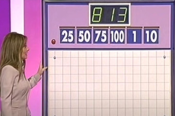

# Solving the Countdown numbers round

[Ben North](https://github.com/bennorth), May 2022

  

    Cards:
    

      <input id="c0" type="text" value="100">
      <input id="c1" type="text" value="7">
      <input id="c2" type="text" value="5">
      <input id="c3" type="text" value="3">
      <input id="c4" type="text" value="2">
      <input id="c5" type="text" value="1">
    

    

      Target:
      <input id="tgt" type="text" value="729">
    

    <button id="solve">Solve!</button>
  

  

  
Solutions will appear here.

  

## Background

On the TV gameshow Countdown, there’s a round where six number cards
are chosen, along with a target number.  Contestants have to use some
or all of the six numbers to construct an arithmetic expression which
evaluates to the target number, or as close as they can get to it.
They’re only allowed the four basic operations (addition, subtraction,
multiplication and division), and at all stages of evaluation, the
result so far must be positive and integer.

## Motivation for this project

There was some recent interest in this game in our house, and, while
realising that I was not going to be the first person to think about
this, I wanted to explore how you could write a computer solver.

## My approach

The approach I took was to try to construct a parse tree for the
expression.  Initially I thought a binary tree would be a good place
to start, followed by a refinement pass to produce an *n*-ary tree, by
collapsing, for example, “(3 + 4) + 5” into “3 + 4 + 5”.  Also, the
ordering of an operation node’s children is unimportant.  I was hoping
there would then be some way to throw out duplicate trees.

After a bit more thought, though, it seemed cleaner to start directly
with the generation of all possible *n*-ary trees.  Some care is needed
to be precise about what this means.  The paper

* [**Counting dendrograms: A
  survey**](https://core.ac.uk/download/pdf/82235912.pdf), Fionn
  Murtagh, Discrete Applied Mathematics 7 (1984)

is concerned with dendrograms, and gives a useful classification of
the different ways of thinking about “all trees”.  It talks about
whether a tree is binary or general-*n*-ary, whether the leaf nodes
are “labelled” or “unlabelled”, and whether the nodes are “ranked” or
“unranked”.  Our situation corresponds to what Murtagh calls
"labelled, non-ranked, non-binary" trees.

To enumerate the possible Countdown expressions without duplication,
the operation (i.e., non-leaf) nodes have to alternate between “+” and
“×” as you travel from the root to the leaves.  The root operation
node can be either kind.  This example's root node (at the top of the
diagram, since computer scientists draw their trees upside-down) is an
addition operation:

<figure>
  
  <figcaption>The expression “(5 × 3) + (7 × (100 + 2))” as a tree</figcaption>
</figure>

Subtraction and division are handled by tagging each non-root node to
say whether its value is used by its parent in a non-inverted or
inverted sense.  An inverted child of a “+” node is actually
subtracted, and an inverted child of a “×” node is actually divided
by.  It is not permitted for all children of a node to be inverted.

In this example, inverted number nodes are shown like this:

<!-- Using https://davidmathlogic.com/colorblind/#%23000000-%23E69F00-%2356B4E9-%23009E73-%23F0E442-%230072B2-%23D55E00-%23CC79A7
 for highlight colours in below.  Lightened a bit. -->

<figure>
  
  <figcaption>The expression “3 × ((100 × 5 ÷ 2) − 7)” as a tree — the
    “7” is an inverted child of a “+” node and so is subtracted, and the
    “2” is an inverted child of a “×” node and so is divided by.
  </figcaption>
</figure>

And another example, where a whole subexpression is inverted (its
operator node is shown like
this):

<figure>
  

  <figcaption>The expression “(7 × (100 + 5)) − (3 × 2)” as a tree —
    the “3 × 2” sub-expression is an inverted child of a “+” node, and
    so is subtracted
  </figcaption>
</figure>

The question then is how to generate all *n*-ary trees with up to six
leaf nodes.  Murtagh described a recursive solution to this problem,
and gives the total number of such trees in the paper's *Table&nbsp;2*
— there are 3020 of them.

Given this large set of trees, we can generate all possible Countdown
expressions with a few extra steps.  For example, suppose we have a
4-leaf-node tree.

We can choose the way the four leaf node labels correspond to four of
the six number cards in 6-choose-4&nbsp;=&nbsp;15 ways.

For each such choice, we can either assign the root node to be a “+”
node or a “×” node.

For each such choice, we alternate between “+” and “×” as we follow
each path to a leaf node.  With that done, we look at each operation
(branch) node in turn.  For each one, we list all proper subsets of
the set of that node’s children.  Then we loop over the Cartesian
product of choices of subsets for all operation nodes.

For each operation node and its chosen subset of children, we mark
that subset of that node’s children as “inverted” and the rest of its
children as “non-inverted”.  The requirement that we choose a *proper*
subset ensures we satisfy the rule that we can’t have an operation node
all of whose children are inverted.

Finally we can evaluate the expression and test whether the result
matches the target.  We also check that it is possible to evaluate the
expression such that all intermediate results are positive integers.

## Implementation

For the implementation, I split the task after generating the *k*-node
*n*-ary trees and choosing which *k* cards from 6 they applied to, and
dumped representations of those trees as ‘programs’ for a stack-based
machine.  The instructions this machine understands are “push card's
value onto the stack” and “pop the top *N* values off the stack,
combine them with *OP*, and push the result back on the stack”.  The
operation *OP* can be addition or multiplication.  The program is then
equivalent to the reverse Polish notation (postfix) representation of
the expression.

The exploration of the choices of which inputs to invert is deferred
until evaluation time.  At the time the programs are generated, we
don't know the values of the cards, so the program refers to `card[0]`
up to `card[5]`, leaving the values to be filled in at evaluation
time.

<figure>
  
  <figcaption>An expression template; its program is C5 C0 C2 C4 M3 C1 A2 M2</figcaption>
</figure>

That part was done in Python, and resulted in 4659 programs.  These
programs are hard-coded into a separate C++ program, which interprets
them as program templates.  It pre-processes the list by copying and
then swapping “+” with “×” in the copies.  It executes the double-size
list of programs by following all the different execution paths
arising from the different choices of what subset of each node's
children to invert.  To ensure we can keep to the rules about always
having positive integer intermediate results, it processes all
non-inverted arguments before any inverted ones.  If the result of any
operation fails to be a positive integer, we abandon that execution
branch.  We also abandon a branch if it involves multiplying
by&nbsp;1.  Multiplying by&nbsp;1 is not strictly against the rules,
but it seems cleaner to exclude those solutions.

To wrap this in something suitable for demonstration on the web, I
compiled the C++ into wasm using emscripten.  A bare JS program takes
care of allowing user input of the cards and target number, feeding
these to the wasm part, and interpreting the valid solutions in a
human-friendly way.

The code is available on GitHub:

* https://github.com/bennorth/countdown-numbers-solver/

## Examples

YouTube has some examples of unusually difficult numbers rounds:

<figure>
  
  <figcaption>
Make the target 952 from the cards 25, 50, 75, 100, 3, and 6.

  
The contestant found the solution ((75 × (100 + 6) × 3) − 50)
    ÷ 25.  The tree-based solver finds this solution and also 25 + (75 ×
    (100 + 3) × 6 ÷ 50).

</figcaption>
</figure>

<figure>
  
  <figcaption>
Make the target 813 from the cards 25, 50, 75, 100, 1, and 10.

  
The contestant found the solution ((25 × (75 − 10)) + 1) × 50 ÷ 100, which the
    tree-based solver also finds.

</figcaption>
</figure>

## Other solvers

I deliberately didn’t look for details of how other solvers worked
before doing this.  Doing so afterwards, I found that almost everyone
else has taken the approach of exploring all valid Reverse Polish
Notation (postfix) expressions; for example, [this nice analysis by
Henriqiue Daitx](https://www.daitx.com/2016/05/01/countdown-math/),
and [this C implementation by Rachel
Evans](https://github.com/rvedotrc/numbers).

[Brute Forcing The Countdown Numbers Game —
Computerphile](https://youtu.be/cVMhkqPP2YI) also uses generation of
RPN programs.  A comment says "The first thing that sprang to mind was
a tree-based approach" but didn't elaborate, and replies didn't
describe what I did in this project.

Some of these analyses note that there are ways to cut down the search
space, which also reduces duplication in the emitted solutions.  For
example, [Tim Hargreaves points
out](https://www.ttested.com/polish-countdown/) that we need not look
at solutions where addition or multiplication expressions have their
operands in non-ascending order; Evans's solver also uses this
observation.

[A solver by David
Llewellyn-Jones](https://github.com/llewelld/countdown) does take a
tree-based approach, using binary trees where all four operators can
appear as the non-leaf nodes.

[HappySoft's Countdown Numbers
game](http://happysoft.org.uk/countdown/numgame.php) ranks highly in
web search results.  It handles the case where the target number can
not be reached exactly; but it does sometimes miss solutions.  For
example, it produces an expression giving 950 for the first example
above.  Its solver is server-side so we can't tell what approach it
takes.

## Validating my solver

To check my solver, I wrote a Python program which repeatedly runs
both my solver and [Evans's RPN-based
one](https://github.com/rvedotrc/numbers), and compares their
solutions.  Some care is needed to come up with a canonical
representation of a given solution, to know when two solutions,
different on the surface, are really “the same”.

Results of this comparison over many thousands of random problems were
that all solutions found by my approach were also found by Evans's,
and vice versa.  Runtime was pretty similar too.  Of the two
approaches, Evans's RPN one has the advantage of more obviously being
correct in terms of not missing solutions, so it was reassuring that
the solution sets matched in all the trials I ran.  The RPN solution
did tend to produce duplicate solutions, though.  As a cherry-picked
example, the problem

* Cards: 50, 6, 75, 100, 10, 8
* Target: 899

when analysed by my solver, has the unique solution

* 75 + ((100 + 10) × 8) − 50 − 6

On the other hand, the RPN solver produces the following 15 solutions:

* ((75 − 6) − 50) + (8 × (10 + 100))
* ((75 − 6) + (8 × (10 + 100))) − 50
* ((75 + (8 × (10 + 100))) − 6) − 50
* (75 − 50) + ((8 × (10 + 100)) − 6)
* (75 + ((8 × (10 + 100)) − 6)) − 50
* (75 − (6 + 50)) + (8 × (10 + 100))
* (75 + (8 × (10 + 100))) − (6 + 50)
* ((75 − 50) − 6) + (8 × (10 + 100))
* ((75 − 50) + (8 × (10 + 100))) − 6
* ((75 + (8 × (10 + 100))) − 50) − 6
* (75 − 6) + ((8 × (10 + 100)) − 50)
* (75 + ((8 × (10 + 100)) − 50)) − 6
* 75 + (((8 × (10 + 100)) − 6) − 50)
* 75 + ((8 × (10 + 100)) − (6 + 50))
* 75 + (((8 × (10 + 100)) − 50) − 6)

which are all essentially the same.

## Future work

It’s possible to have two cards with the same number.  The tree-based
solver described here can produce duplicated solutions if given
repeated numbers for the cards.  For example, for the problem

* Cards: 3, 3, 25, 50, 75, 100
* Target: 996

(which [the DataGenetics blog
reports](https://datagenetics.com/blog/august32014/index.html)
involves the largest intermediate value (99,600) of any possible
game), my solver gives the two essentially identical solutions

* (((3 + 50) × 25) + 3) × 75 ÷ 100
* (3 + ((3 + 50) × 25)) × 75 ÷ 100

It shouldn't do this.

In the real game, if the target cannot be reached, the winner is the
person who can get closest to it.  The tree-based solver here does not
produce anything if it can't get the target exactly.  It should.

## Source

The code for the solver (and this write-up) is available on GitHub:

* https://github.com/bennorth/countdown-numbers-solver/
